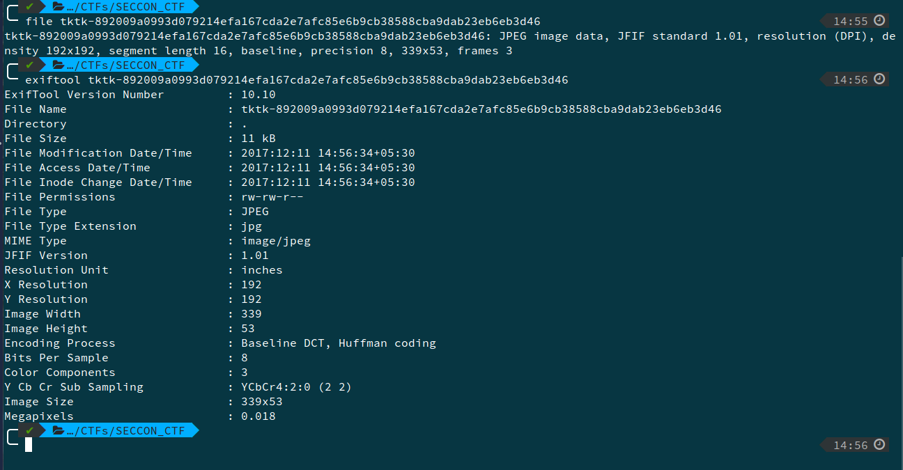
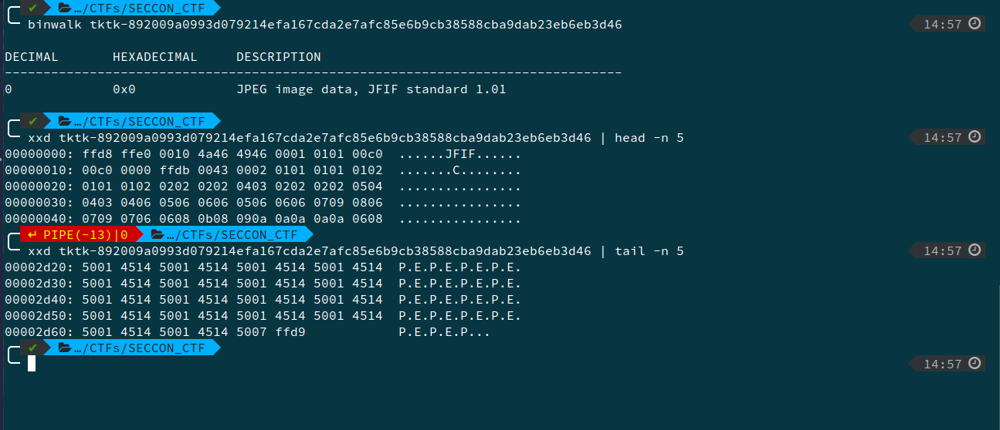

# JPEG file, Binary, 100pts

## Problem

Read this JPEG is broken.
It will be fixed if you change somewhere by 1 bit.

## Solution

We try with the following commands  
```
file tktk-892009a0993d079214efa167cda2e7afc85e6b9cb38588cba9dab23eb6eb3d46

exiftool tktk-892009a0993d079214efa167cda2e7afc85e6b9cb38588cba9dab23eb6eb3d46

binwalk tktk-892009a0993d079214efa167cda2e7afc85e6b9cb38588cba9dab23eb6eb3d46

xxd tktk-892009a0993d079214efa167cda2e7afc85e6b9cb38588cba9dab23eb6eb3d46 | head -n 5

xxd tktk-892009a0993d079214efa167cda2e7afc85e6b9cb38588cba9dab23eb6eb3d46 | tail -n 5
```





but don't find anything.

If we try
```
gimp -c tktk-892009a0993d079214efa167cda2e7afc85e6b9cb38588cba9dab23eb6eb3d46 | tail -n 5
```


we get an error message `JPEG image-Warning: Unsupported marker type 0xfc`. Opening the image in a hex editor, we replace `fffc` with `ff00`.  
This gives us the flag as   
.

--------
Another method is to try flipping all the bits, by the following script
```python
with open("broken.jpg") as f:
    a = f.read()

def flip(er, n):
    return chr(ord(er) ^ (1<<n))

for i in xrange(1000):
    for j in xrange(8):
        b = a[:i] + flip(a[i], j) + a[i+1:]
        with open("temp/" + str(i*10+j)+'.jpg', 'wb') as f:
            f.write(b)
```
Then we go through all the files in the temp directory,
and we find the file `6230.jpg` gives us the flag.
